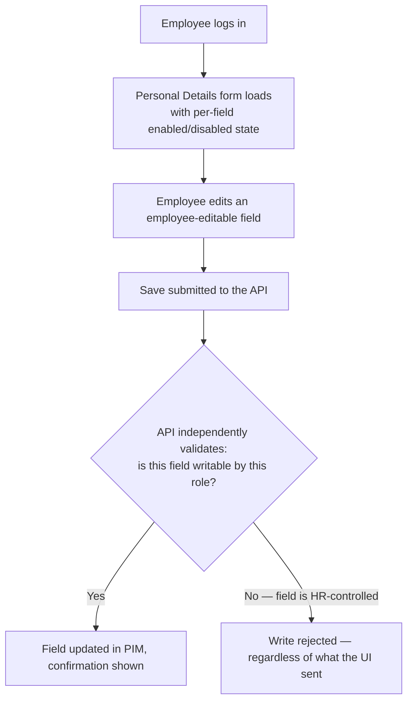

# 👥 HRMS Platform

**A Human Resource Management System with Employee Self-Service (ESS) — QA & Automation Portfolio Project**

> This repository documents the QA strategy, manual and automated test coverage, and testing
> approach applied to an **HRMS platform**, with a focus on the **Employee Self-Service (ESS /
> MyInfo)** module — the portal employees use to log in and manage their own personal details.
>
> All content here uses **generic/sample data only**. No client names, company names, or
> confidential/production information are included. Dates and timelines are placeholders —
> update `[Timeline]` before publishing.
>
> 📍 **New here?** [`docs/README.md`](./docs/README.md) is a documentation map answering "what is
> this, how does it work, who's involved, what does it depend on" — with a recommended reading
> order through every doc in this repo.

---

## 📖 Table of Contents

1. [What is an HRMS / ESS Module?](#-what-is-an-hrms--ess-module)
2. [My Role](#-my-role)
3. [Tech Stack & Tools Used](#-tech-stack--tools-used)
4. [Types of Testing Performed](#-types-of-testing-performed)
5. [How It Works — ESS Save Flow](#-how-it-works--ess-save-flow)
6. [Key Achievements](#-key-achievements)
7. [Automation Approach](#-automation-approach)
8. [Regression Checklist](#-regression-checklist)
9. [Screenshots & Reports](#-screenshots--reports)
10. [Repository Structure](#-repository-structure)

> Deeper dives not covered inline in this README: [Modules, Submodules & Stakeholders](./docs/business-overview.md),
> [Architecture, Flow & Real Sequence Diagrams](./docs/architecture-and-flow.md),
> [Full Tech Stack & Skills Demonstrated](./docs/tech-and-skills.md), [UI Consistency](./docs/ui-consistency.md)
> — see [`docs/README.md`](./docs/README.md) for the full map. **Every diagram in this repo is
> drawn in Mermaid and renders natively right here on GitHub — nothing requires visiting another
> site.**

---

## 💡 What is an HRMS / ESS Module?

A **Human Resource Management System (HRMS)** streamlines core HR operations — payroll
compliance, attendance, leave, recruitment, performance management, onboarding, and biometric
integration — under one platform with role-based access control.

The **Employee Self-Service (ESS)** module — sometimes called "MyInfo" — is the employee-facing
slice of that system: it's where an individual employee logs in and manages their own personal
and contact details, separate from what HR/Admin manages on their behalf. Because ESS is
employee-facing and touches personally identifiable information, it has a distinct QA emphasis
compared to admin-side HRMS modules:

- **Strict field-level access control** — some fields (e.g. Employee ID, Date of Birth, Driver's
  License Number) are typically HR-managed and shown as read-only/disabled to the employee, while
  others (e.g. Nickname, Marital Status) are employee-editable
- **GUI element behavior correctness** — text boxes, combo boxes, radio buttons, and date pickers
  must each behave exactly as their control type implies, since this form is filled out
  repeatedly by every employee in the company
- **File upload validation** — profile picture uploads need both format and size validation

### Who typically interacts with it?

| Role | What they do |
|---|---|
| **Employee (ESS user)** | Logs in, views and updates their own permitted personal/contact details |
| **HR Admin** | Creates ESS user accounts, manages the fields employees cannot self-edit |

---

## 👤 My Role

QA Engineer responsible for manual functional, GUI, and data-validation testing of the HRMS ESS
module, with API-level validation support.

- Designed and executed **manual test cases** covering functional, regression, smoke, and sanity
  testing for HRMS modules, achieving a 90%+ test case pass rate before UAT
- Conducted **manual API testing** using Postman and SQL database validation, identifying 30%+
  of critical defects pre-release
- Validated **field-level GUI behavior** — enabled/disabled state, text input, combo box
  single-select behavior, radio button exclusivity, and date-picker correctness — for every
  field on the ESS Personal/Contact Details form
- Validated **file upload constraints** (accepted formats, size limits) for profile picture
  uploads
- Raised and managed defects in JIRA, ensuring **zero critical defects escaped to production**
  across payroll and compliance-adjacent modules

**Timeline:** `[Add Duration]`

---

## 🛠 Tech Stack & Tools Used

| Category | Tools |
|---|---|
| **Manual Testing** | Functional, GUI, Database/Data-validation testing |
| **API Testing & Automation** | Postman, SQL (direct database validation) |
| **UI Automation** | Selenium WebDriver, Java, TestNG |
| **Build Tool** | Maven |
| **Performance Testing** | JMeter (concurrent login/access-storm load testing) |
| **Bug Tracking & Traceability** | JIRA, RTM (Requirement Traceability Matrix — see [`sample-rtm.md`](./sample-rtm.md)) |
| **Version Control** | Git, GitHub |

> Full detail on *why* each tool was chosen, a skill → proof map, and the performance testing
> approach in depth: [`docs/tech-and-skills.md`](./docs/tech-and-skills.md).

---

## 🧪 Types of Testing Performed

- **Functional Testing** — login, personal/contact details save and update flows
- **GUI Testing** — field enabled/disabled state, control-type behavior (text box, combo box,
  radio button, date picker)
- **Database/Data-Level Testing** — validating that saved changes are correctly persisted
- **File Upload Validation** — format and size constraint testing
- **API Testing** — via Postman with SQL-backed validation
- **Security-Adjacent Field-Authorization Testing** — confirming HR-controlled fields are
  rejected by the save API directly, independent of the UI (see
  [`docs/architecture-and-flow.md`](./docs/architecture-and-flow.md) section 3 — this maps to
  OWASP's Broken Object Property Level Authorization classification)
- **Performance Testing** — concurrent login/access-storm load testing with JMeter (see
  [`docs/tech-and-skills.md`](./docs/tech-and-skills.md) section 5)
- **Regression Testing** / **Smoke & Sanity Testing**

---

## 🔄 How It Works — ESS Save Flow



**Key testing principle:** the enabled/disabled state rendered in the UI is a usability signal,
not a security boundary — the save API has to make its own independent decision about which
fields a given role may write, every single time, regardless of what the client submits. See
[`docs/architecture-and-flow.md`](./docs/architecture-and-flow.md) for the full set of sequence
diagrams, including exactly how skipping that independent check produced a real defect.

---

## 🏆 Key Achievements

- Achieved a **90%+ test case pass rate** before UAT across HRMS modules
- Identified **30%+ of critical defects pre-release** through manual API testing combined with
  direct SQL database validation
- Ensured **zero critical defects escaped to production** across payroll and compliance-adjacent
  modules
- Built a detailed, field-by-field GUI validation suite for the ESS Personal/Contact Details
  form — covering every control type (text, combo, radio, date, file upload) rather than
  spot-checking a subset

---

## 🤖 Automation Approach

Automation is built with **Selenium WebDriver + Java + TestNG**, targeting the highest-priority
ESS flows (login and personal details save) as a complement to the broader manual regression
suite, backed by JMeter for concurrent login/access-storm performance testing (see
[`docs/tech-and-skills.md`](./docs/tech-and-skills.md) section 5).

### Priority Automated Scenarios

1. Login — valid credentials
2. Login — invalid credentials (negative cases)
3. Personal Details — field enabled/disabled state verification
4. Personal Details — save/update confirmation
5. Concurrent login/access-storm load testing (JMeter)

See [`automation/`](./automation) for the framework README and a sample spec file using dummy
data.

---

## ✅ Regression Checklist

- [ ] Login — valid credentials
- [ ] Login — invalid username / invalid password / both invalid
- [ ] Personal Details — GUI element enabled/disabled state
- [ ] Personal Details — GUI element behavior (text box / combo box / radio button / date picker)
- [ ] Personal Details — save/update persistence
- [ ] Profile Picture Upload — valid format (jpg/png/gif)
- [ ] Profile Picture Upload — size under limit
- [ ] Profile Picture Upload — size over limit (rejection)
- [ ] UI Consistency (field state, messaging, accessibility)

Full checklist with edge cases available in [`regression-checklist.md`](./regression-checklist.md).

---

## 📸 Screenshots & Reports

Sample test execution reports, defect report templates, and a worked Requirement Traceability
Matrix are available in [`regression-execution-summary.md`](./regression-execution-summary.md),
[`sample-defect-report.md`](./sample-defect-report.md), and [`sample-rtm.md`](./sample-rtm.md).

---

## 📁 Repository Structure

> **New here?** Start with [`docs/README.md`](./docs/README.md) — a documentation map that
> answers "what is this, how does it work, who's involved, what does it depend on" and points to
> exactly the right doc for each question.

```
hrms-platform/
├── README.md
├── regression-checklist.md          → Full ESS Login + Personal Details test suite
├── sample-defect-report.md          → Defect theme taxonomy + worked defect examples
├── sample-rtm.md                    → Worked Requirement Traceability Matrix, including real coverage gaps
├── regression-execution-summary.md  → Sample regression test execution report
├── docs/
│   ├── README.md                    → 📍 Documentation map — start here
│   ├── business-overview.md         → What HRMS/ESS is, modules/submodules, field-access-control model
│   ├── architecture-and-flow.md     → Real Mermaid sequence/flow diagrams: save flow, the BOPLA mechanism
│   │                                    behind Defect #1, file-upload validation
│   ├── tech-and-skills.md           → Full tech stack (with why), skill → proof map, CI/CD shape, performance depth
│   └── ui-consistency.md            → Cross-form UI/UX consistency (field state, messaging, a11y)
└── automation/
    ├── README.md                    → Framework setup & structure
    └── SampleEssLoginTest.java      → Sample Selenium + TestNG test (dummy data)
```

> **Note on structure:** `bug-reports/`, `test-cases/`, and `test-reports/` were originally
> separate folders, each holding a single file — flattened to the repo root since a folder
> holding exactly one file adds navigation overhead without organizing anything. `docs/` and
> `automation/` remain folders because each genuinely groups multiple related files.
