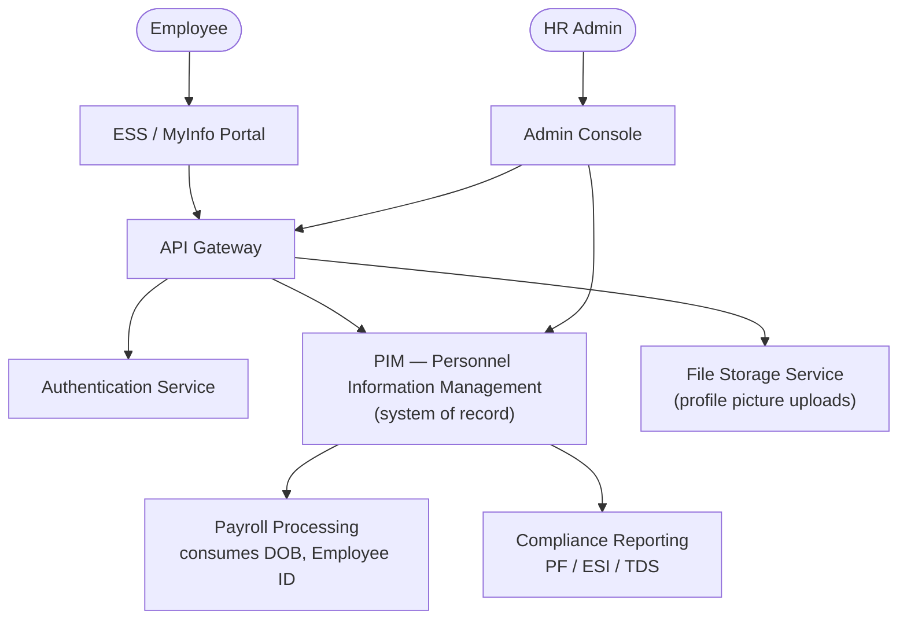
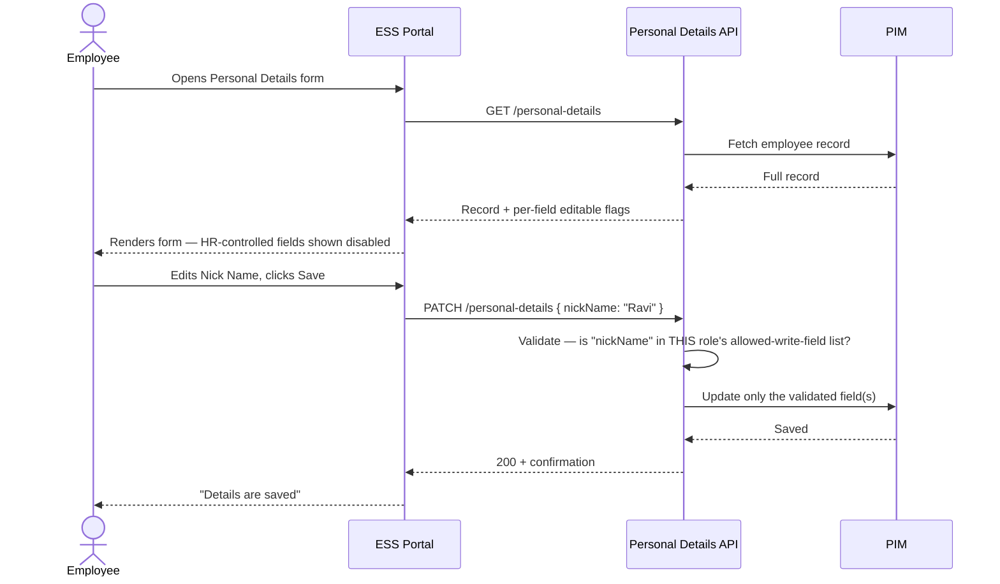
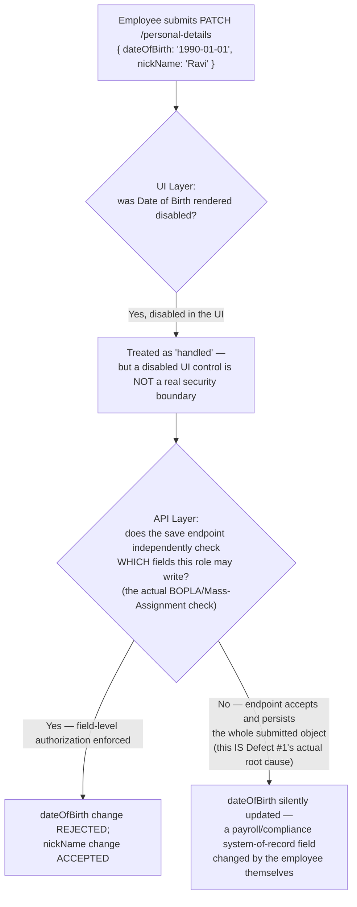
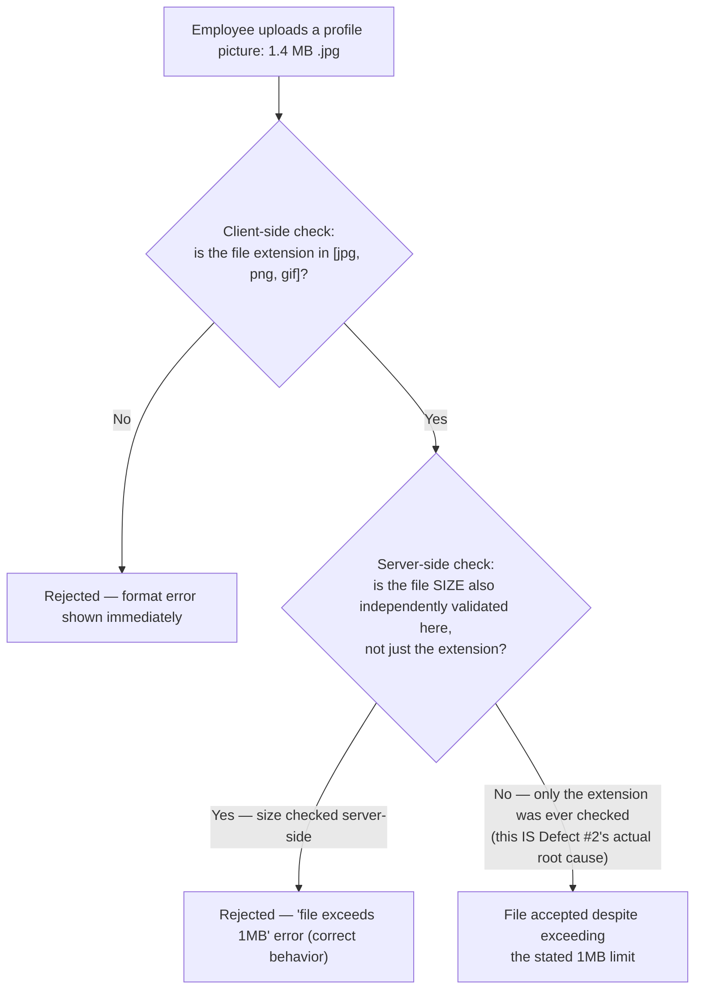

# HRMS Platform — Architecture & Flow

> See [`business-overview.md`](./business-overview.md) for why field-level access control is
> this module's central risk, [`tech-and-skills.md`](./tech-and-skills.md) for the tools and
> skills behind this testing approach, and [`README.md`](./README.md) for the full documentation
> map.
>
> Every diagram below is drawn in [Mermaid](https://mermaid.js.org/), which GitHub renders
> natively in-page — nothing here requires opening another site or tool to read it.

## 1. System Architecture — Who Talks to Whom

**Why Payroll and Compliance are drawn as downstream consumers of PIM, not of the ESS form
itself:** per [`business-overview.md`](./business-overview.md) section 7, the fields ESS marks
HR-controlled (Date of Birth, Employee ID, Driver's License Number) aren't arbitrarily locked —
they're locked because Payroll and statutory compliance reporting (PF, ESI, TDS) read them
directly from PIM as system-of-record values. An access-control bug in ESS doesn't just corrupt
one employee's profile view; it can corrupt what payroll and compliance systems compute from, if
the write actually reaches PIM.

## 2. Editing & Saving Personal Details

**The line that matters most in this diagram:** `API->>API: Validate — is "nickName" in THIS
role's allowed-write-field list?` That check has to run **regardless of what the UI sent**, and
specifically per-field, not just "is this employee allowed to call this endpoint at all." Section
3 shows exactly what happens when that line is skipped.

## 3. Field-Level Access Control as Defense in Depth — the Real Mechanism Behind Defect #1

[`sample-defect-report.md`](../sample-defect-report.md) Defect #1 (Date of Birth editable by the
employee) maps directly onto a named, well-documented API vulnerability class — **OWASP
API3:2023, Broken Object Property Level Authorization (BOPLA)**, which consolidates what used to
be called "Mass Assignment": an API that checks whether a user can access an *object* (this
employee's own record) but never checks whether they can write a specific *property* on it.

**Why "the UI disables it" was never going to be enough on its own:** disabling a field in a
browser only stops a well-behaved browser session from *rendering* an editable input — it does
nothing to a request sent directly to the API (via a modified request, a replay, or simply a
client bug that forgot to strip the field). [`sample-defect-report.md`](../sample-defect-report.md)'s
suggested fix — "enforce the field-access-control list at the form-rendering layer *and* at the
save/API layer as defense-in-depth" — is this diagram's right-hand branch: the UI layer is a UX
convenience, the API layer is the actual control, and a system that only has the first is one
authorization check away from the exact defect that shipped here.

## 4. File Upload Validation — the Real Mechanism Behind Defect #2

**Why this is the same *shape* of bug as Defect #1, even though it's a completely different
feature:** both defects are "a constraint was enforced at exactly one layer, and that layer
happened to be the wrong one to rely on alone." Format validation by file extension is trivially
checkable client-side for fast feedback, but file *size* is exactly the kind of constraint a
client can't be trusted to enforce honestly — the fix in both Defect #1 and Defect #2 is
structurally identical: **validate server-side, treat client-side validation as UX, not
security/correctness.**

---

**Sources for the real-world standard referenced above** (used to ground this document's
Defect #1 diagram in a genuine, current API-security classification, not an invented one):
[OWASP API3:2023 — Broken Object Property Level Authorization](https://owasp.org/API-Security/editions/2023/en/0xa3-broken-object-property-level-authorization/).
