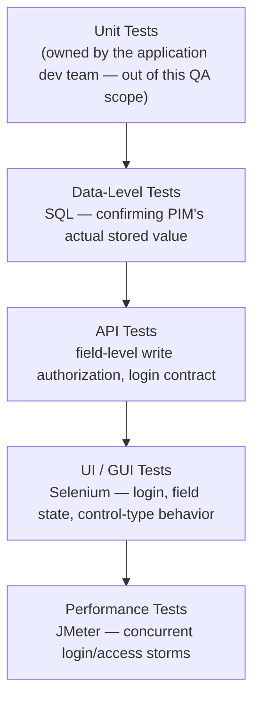
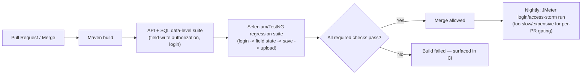

# HRMS Platform — Tech Stack & Skills Demonstrated

> Everything in this doc is answerable by reading this repo alone — no need to visit an external
> site to understand what was used or why. See [`business-overview.md`](./business-overview.md)
> for the product/module breakdown and [`architecture-and-flow.md`](./architecture-and-flow.md)
> for how the system actually behaves.

## 1. Full Tech Stack, and Why Each Tool

| Category | Tool | Why This Tool Specifically |
|---|---|---|
| **Manual Testing** | Functional, GUI, Database/Data-validation testing | This module's regression suite is primarily manual by design (see the README's "My Role") — field-by-field GUI correctness and access-control testing benefit from a human verifying actual rendered state, not only an assertion |
| **API Testing** | Postman, SQL (direct database validation) | Confirms what was *actually written to PIM*, independent of what the UI reports — the only way to catch a BOPLA-class defect (section 3 of [`architecture-and-flow.md`](./architecture-and-flow.md)) where the save "succeeds" but writes a field it shouldn't have |
| **UI Automation** | Selenium WebDriver + Java + TestNG | Targets the highest-value, most repetitive cases (login negative-case matrix, field-state verification) as a complement to the manual suite, not a replacement for it |
| **Build Tool** | Maven | Standard JVM build/dependency management, keeping UI automation and performance testing (JMeter, below) on one consistent toolchain |
| **Performance Testing** | JMeter | Chosen to stay in the same JVM ecosystem as Selenium/TestNG/Maven — see section 5 below for what it's actually used for in this domain |
| **Bug Tracking** | JIRA | Full defect lifecycle tracking — see [`../sample-defect-report.md`](../sample-defect-report.md) |
| **Version Control** | Git, GitHub | This repo itself; diagrams throughout are Mermaid, which GitHub renders natively with zero extra tooling |

## 2. Skills Demonstrated — Skill → Where to See It

| Skill | Demonstrated By | Where to Look |
|---|---|---|
| **Manual / Functional Testing** | Full login + field-by-field Personal Details test suite | [`../regression-checklist.md`](../regression-checklist.md) |
| **API Testing** | SQL-backed validation confirming PIM's actual stored value, not just the UI's displayed one | [`../regression-checklist.md`](../regression-checklist.md) section 4 |
| **UI Automation** | Selenium + TestNG spec covering login and field-state verification | [`../automation/SampleEssLoginTest.java`](../automation/SampleEssLoginTest.java) |
| **GUI / Control-Type Testing** | A field-by-field validation suite covering every control type (text, combo, radio, date, file upload) rather than spot-checking a subset | [`../regression-checklist.md`](../regression-checklist.md) sections 2–3 |
| **Database / Data-Level Testing** | Confirming a save is actually persisted in PIM, and confirming exactly which fields a write touches | [`../regression-checklist.md`](../regression-checklist.md) section 4 |
| **Performance Testing** | JMeter-based login/access-storm load testing — see section 5 | Section 5 below |
| **Security-Adjacent Testing (Field-Level Authorization)** | A dedicated defense-in-depth test category tracing directly to a named OWASP vulnerability class | [`../sample-defect-report.md`](../sample-defect-report.md) Defect #1; [`architecture-and-flow.md`](./architecture-and-flow.md) section 3 |
| **Requirement Traceability (RTM)** | A worked requirement → test case → status mapping | [`../sample-rtm.md`](../sample-rtm.md) |
| **Defect Management & Root-Cause Analysis** | Worked defects identifying the actual mechanism (a UI-only control with no server-side equivalent) rather than just the symptom | [`../sample-defect-report.md`](../sample-defect-report.md) |
| **Test Reporting & Metrics** | A structured execution summary with pass/fail breakdown by area | [`../regression-execution-summary.md`](../regression-execution-summary.md) |
| **Technical Documentation & Communication** | This entire `docs/` set | This doc set, start to finish |

## 3. The Testing Pyramid Applied to This Project

**Why Data-Level sits just above Unit here too, same reasoning as this portfolio's fintech
repos:** a UI assertion that a field "looks disabled" can't tell you whether a direct API call
bypassing that UI would still be rejected. Only a check against PIM's actual stored value (or the
API's actual accepted/rejected response) answers that question.

## 4. CI/CD — Suggested Pipeline Shape

> **Note on scope, matching this repo's existing honesty convention** (see
> [`../automation/README.md`](../automation/README.md)): this repo includes one representative
> Selenium/TestNG spec rather than the full framework, to stay focused as a portfolio piece. The
> pipeline below is the **suggested shape** that automation is designed to slot into, not a claim
> that a live CI instance with this exact pipeline is currently running against this repo.

## 5. Performance Testing, In Depth

HRMS/ESS has a performance profile that looks almost nothing like this portfolio's fintech
products: **every single employee in the company uses it**, but each one just views or edits
their own profile occasionally — this is high **concurrency of low-value requests**, not high
**throughput of transactional volume**. The realistic load events are predictable and
organizational, not continuous:

| Test Type | What It Targets | Why It Matters Here Specifically |
|---|---|---|
| **Login storm / concurrent-session load test** | Many employees logging in within the same narrow window (e.g., Monday morning, or right after a company-wide HR announcement) | A login/session-creation bottleneck here affects the entire employee base at once, not a subset — this is this module's closest analog to a "peak traffic" event |
| **Mass-update spike test** | A company-wide policy change (e.g., a benefits re-enrollment) that prompts a large fraction of employees to edit and save their Personal Details within the same day or two | Unlike steady background edits, this concentrates write load — exactly the path the field-level authorization check (section 3 of `architecture-and-flow.md`) runs on every single request |
| **File-upload soak test** | Sustained profile-picture upload traffic over a longer window | Catches storage/throughput degradation that a short burst wouldn't reveal, directly relevant to the size-validation defect class in Defect #2 — a server-side check that works fine under light load can still behave inconsistently under sustained concurrent upload pressure if it isn't implemented carefully |

**What this is deliberately not:** a claim that ESS needs to sustain thousands of transactions
per second like a payment engine. The point of testing this module's performance at all is
narrower and more realistic — confirming the system doesn't degrade or (worse) silently skip a
validation step under the one kind of load pattern this specific product actually experiences:
many people, at once, doing the same simple thing.

## 6. Why This Doc Exists Separately From business-overview.md

[`business-overview.md`](./business-overview.md) answers *what* this module is and *why* its
risk model looks the way it does. This doc answers a different question — *how* that gets tested
and with what tools — so a reader scanning for technical/skill evidence doesn't have to filter it
out of the business-context narrative, and vice versa.
